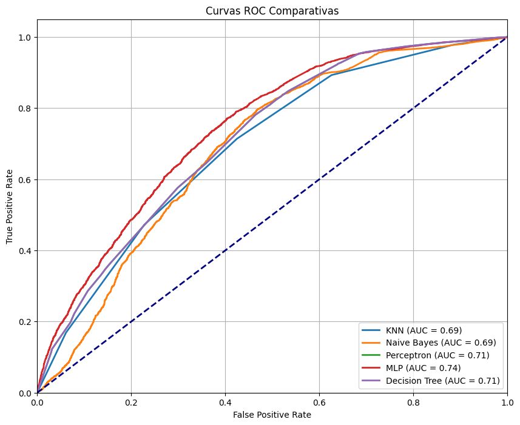
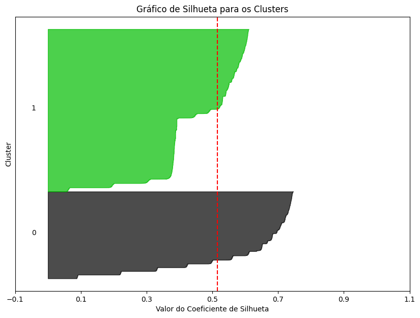
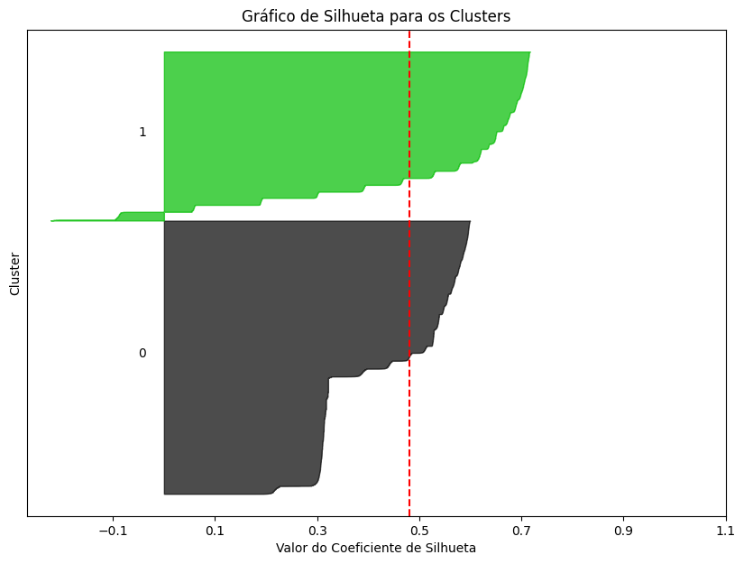

<h1 align="center">🤒 Predicting Influenza 🤒</h1>

<div align="center">
	<a href="link_for_webite">
	
    </a>
</div>

## Developed by 💻:
- [Fernando Schettini](https://linktr.ee/fernandoschett).
- [Augusto Barreto](https://github.com/augustobarreto).

## Special thanks to 🥰:
- [Ricardo Rios](https://github.com/ricardoarios), your experience and knowledge have been invaluable to our progress.

## About 🤔:
This project analyzes data on suspected COVID-19 Influenza-Like Illness (ILI) cases from Brazil's e-SUS Notifica system in 2024. Using classical AI models, including KNN, Decision Tree, MLP, Perceptron, K-Means Complete Link, and a Bayesian Classifier, the project preprocesses the data and compares the performance of these models.

## Resourses 🧑‍🔬:
- **Data** preprocessing;
- F1 and recall methods **comparison**;
- Comparative ROC **curve graph**;
- **Silhouette analysis** for unsupervised methods;
- **Dendrogram** for the complete link method; 

## Results 📈:

The best prediction methods were the decision tree and MLP. Unsupervised methods did not perform well in creating groups of sick and healthy individuals.

## SuperVised Models:

<h4 align="center">Table 1 - Results comparison between methods. </h4>

| Método                                         |   F1-Score (Avg)  |   Recall (Avg)   |
|:----------------------------------------------:|:-------------------:|:------------------:|
| **K-NN** (n=5)                                     |  0.7025 ± 0.0087    |  0.7392 ± 0.0116   |
| **Árvore de Decisão** (max_depth=5, min_samples_leaf=10) |  0.7422 ± 0.0116    |  0.8359 ± 0.0259   |
| **Class. Bayesiano**                               |  0.6655 ± 0.2047    |  0.7392 ± 0.2380   |
| **Perceptron** (iter=200)                          |  0.5858 ± 0.2347    |  0.6998 ± 0.3720   |
| **MLP (iter=300)**                                 |  0.7472 ± 0.0135    |  0.8258 ± 0.0195   |


<div align="center">
	<a href="">
	
    </a>
</div>
<h4 align="center">Figure 1 - ROC Curve comparison graph.</h4>


## Non-SuperVised Models:

| Método                  |       Jaccard       |   Silhueta (Avg)   |
|:-----------------------:|:-------------------:|:-------------------:|
| **K-Means** (n=2)           | 0.2951239424104527  | 0.5853294620160377  |
| **Complete Link** (n=2)     | 0.31986874200238724 | 0.48111038632360703 |


<div align="center">
	<a href="">
	
    </a>
</div>
<h4 align="center">Figure 2 - Silhuette for K-means.</h4>

<div align="center">
	<a href="">
	
    </a>
</div>
<h4 align="center">Figure 3 - Silhuette for Complete Link.</h4>

## Dependencies 🚚:

The project dependencies are described in  ```./dependencies/requirements.``` within the repository.

For installing dependencies more quickly, you can run the following command at terminal, inside the clonned repository:

	sudo apt update && sudo apt install python3 python3-pip
    pip3 install -r ./dependencies/requirements.txt
	
## How to contribute 🫂:

Feel free to create a new branch, fork the project, create a new Issue or make a pull request contact one of us to develop at Predicting Influenza.

## Licence 📜:

[Apache V2](https://choosealicense.com/licenses/apache-2.0/)

